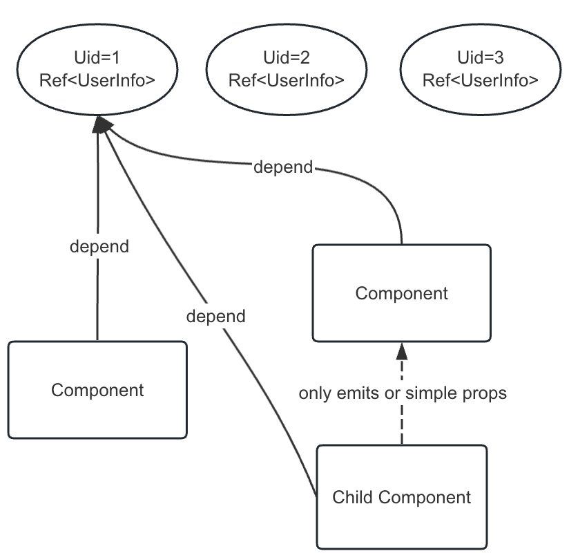

# vue-multi-store

Helps you quickly write components with data sharing between them and reduce coupling between components when using Vue3.

## What is this?

In Vue, the state management was originally designed to store only one set of data, such as user information or work order information.

If you need to store multiple sets of information, you would need to modify the implementation solution, which means refactoring the code.

However, thanks to Vue3's Composition API, we can design an API like this to quickly store any number of different types of information for multiple components.

```html
<script lang="ts" setup>
  // interface.ts
  interface UserInfo {
    name: string;
    age: 18;
  }

  onMounted(async () => {
    const uid = router.query.id; // User Id
    const resultUserInfo = await request(); // do something...

    // Set arbitrary type of data and share it
    // Parameter 1: Data category
    // Parameter 2: Data ID
    // Parameter 3: New data value to be set
    setState<UserInfo>("User", uid, {
      name: "My Name",
      age: 18,
    });
  });
</script>

<template>
  <div>
    <h4>User Info:</h4>
    <child-component></child-component>
  </div>
</template>
```

Usage in child component:

```html
<!-- Child component -->
<script lang="ts" setup>
  const uid = router.query.id; // User Id, or use props
  // Get user information
  // Parameter 1: Data category
  // Parameter 2: Data ID
  // Return: Ref<UserInfo | undefined>
  const userInfo = getState<UserInfo>("User", uid);

  // Asynchronously modify UserInfo, the parent component and other components that use this data will be updated reactively
  setTimeout(() => {
    if (userInfo.value) userInfo.value.name = "Yoooo～";
  }, 6000);
</script>

<template>
  <div v-if="userInfo">{{ userInfo }}</div>
  <div v-else>Loading...</div>
</template>
```

## Conclusion

From the above code, we can conclude that the child component will receive a `Ref<UserInfo | undefined>`, which will be updated reactively when other components modify it. Therefore, it can be applied to many scenarios, such as sharing data between child components, sibling components, or even parent components.

It helps decouple the high-coupling relationships between parent, child, and sibling components, eliminates the need for deep binding caused by props passing between components, and allows them to depend on this global "state" together, achieving reactive synchronization updates. This effectively solves the problem of high coupling between components.



## Disadvantages

It violates the principle of one-way data flow in Vue3, and over time it may cause some confusion. The main design inspiration here comes from Redis, which is often used in backend development for data sharing.

## Memory Recycle Handling

As you can see, various "states" with `UID=1` and `UID=2` persist, but some data is no longer needed and should be recycled.

Thanks to the Composition API, we have implemented calculation based on references, and when the component is destroyed, we release the relevant instances based on the reference count.
