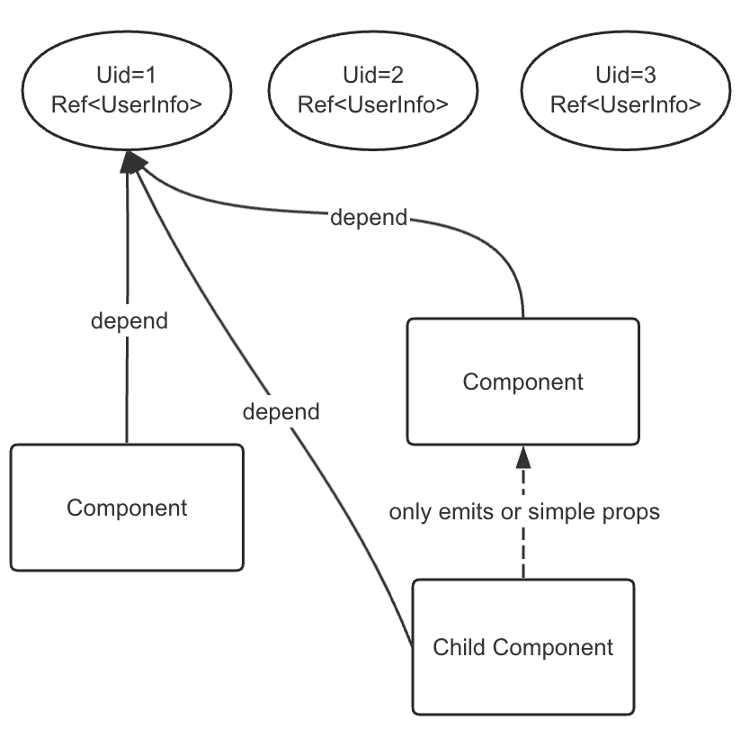

# vue-multi-store

帮助您在使用 Vue3 时快速编写组件之间数据共享，并且减少组件之间的耦合性。

## 这是什么？

Vue 的状态管理大部分情况最开始设计时都认为只会储存一份数据，比如某个用户的信息，又或者某个工单的信息。

如果要同时储存多份信息，则需要对实现方案进行改造，也就是重构代码。

但是得益于 Vue3 的组合式 API，我们可以设计一套这样的 API 来实现快速储存任意份不同类型的信息，用于多个组件

```html
<script lang="ts" setup>
  // interface.ts
  interface UserInfo {
    name: string;
    age: 18;
  }

  onMounted(async () => {
    const uid = router.query.id; // User Id
    const resultUserInfo = await request(); // do something...

    // 设置一个任意类型数据并且共享
    // 参数1: 数据类别
    // 参数2: 数据ID
    // 参数3: 设置的新数据值
    setState<UserInfo>("User", uid, {
      name: "My Name",
      age: 18,
    });
  });
</script>

<template>
  <div>
    <h4>User Info:</h4>
    <child-component></child-component>
  </div>
</template>
```

子组件使用：

```html
<!-- Child component -->
<script lang="ts" setup>
  const uid = router.query.id; // User Id，or use props
  // 获取用户信息
  // 参数1: 数据类别
  // 参数2: 数据ID
  // Return: Ref<UserInfo | undefined>
  const userInfo = getState<UserInfo>("User", uid);

  // 异步改变 UserInfo，父组件和其他使用这份数据的组件都会响应式的更新
  setTimeout(() => {
    if (userInfo.value) userInfo.value.name = "Yoooo～";
  }, 6000);
</script>

<template>
  <div v-if="userInfo">{{ userInfo }}</div>
  <div v-else>Loading...</div>
</template>
```

##

从上述代码可以得出结论：子组件将获得一个 `Ref<UserInfo | undefined>`，此数据将响应式的因为其他组件的改动而改动，所以它可以应用到很多场景，比如子组件，兄弟组件甚至父组件的数据共享。

用于解耦父，子，兄弟组件之间高耦合情况，让多个 Vue 组件之间不再依赖 props 互相传值导致深度绑定，大家共同依赖这个全局的“状态”，并且也实现响应式同步更新，这样可以很有效的解决组件之间的高耦合的问题。



## 缺点

违背了 Vue3 数据单项流原则，时间长了可能会造成一定的混乱，这里是因为主要的设计灵感来自后端开发为了实现数据共享而经常使用的 Redis。

## 内存回收处理

可以看见，有 UID=1，UID=2 的各种 “状态” 持久存在，但是有些数据不再需要时，应该必须回收。
得益于组合式 API，我们实现了根据引用来计算，待组件销毁后根据引用数框来释放相关实例。
